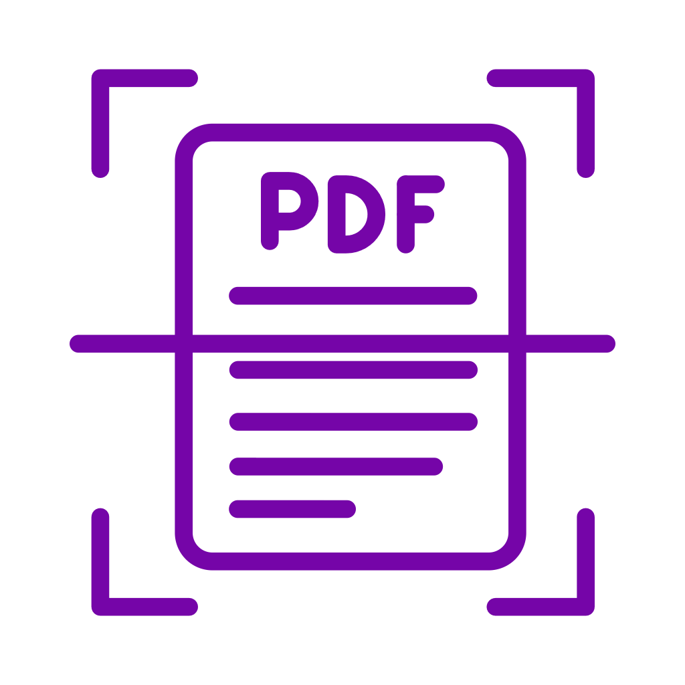

  
  <h1 style="margin: 0;">Pocket Scanner — Privacy Policy</h1>

**Effective date:** May 28, 2026

Pocket Scanner is built for people who don't want a scanner app to know anything about them. This policy describes exactly what data the app handles and what it doesn't.

## The short version

- We don't collect any personal data.
- We don't have a server. Your scans never leave your device except to sync to your own iCloud account.
- We don't use analytics, telemetry, advertising SDKs, or tracking of any kind.
- We don't share, sell, or otherwise transfer any data, because we don't have any to transfer.

## What the app does on your device

- **Camera access** — used to capture document images when you tap the scan button. Images are processed entirely on your iPhone.
- **Optical character recognition (OCR)** — every scanned page is run through Apple's Vision framework on your device to extract searchable text. Nothing is uploaded to any server, including ours or Apple's, for this step.
- **iCloud Drive** — if you have iCloud Drive enabled and the app has access, your saved PDFs are written to a folder in *your* iCloud account ("Pocket Scanner"). This is Apple's storage you already control. We do not have any access to that storage.
- **Local storage** — if iCloud Drive is not available, the app stores your PDFs in its own local sandbox on your device.
- **Face ID / passcode** — used only to gate the app's library when you enable the App Lock setting. Authentication is handled by Apple's LocalAuthentication framework; we never see or store your biometric data.

## What the app does NOT do

- Pocket Scanner does not have a backend server. There is no account to create and no place for your data to be sent.
- Pocket Scanner does not include any third-party SDKs for analytics, crash reporting, advertising, attribution, or user tracking.
- Pocket Scanner does not access, transmit, or store the contents of your scanned documents anywhere outside your own device and iCloud account.
- Pocket Scanner does not read your filenames, search queries, or any usage data.

## Data Apple may collect

Apple operates the App Store and iCloud Drive, and may collect data related to your use of those services per [Apple's own privacy policy](https://www.apple.com/legal/privacy/). This includes things like crash reports you opt into sharing with developers via iOS Settings, app analytics aggregated by Apple, and iCloud sync metadata. Apple does not give us your personal information; we may see aggregated, anonymized download counts and crash statistics through App Store Connect.

## Children

Pocket Scanner is not directed at children under 13. It does not collect any data from any user regardless of age. The app's content rating is 4+.

## Changes to this policy

If we ever change what data the app handles, we'll update this page and bump the effective date. Material changes will be noted in the app's release notes on the App Store.

## Contact

Questions or concerns: **<peterjones@mac.com>**

---

*Pocket Scanner is built and maintained by Peter Jones as an independent project. The source is public at [github.com/peterajones/mobileDocumentScanner](https://github.com/peterajones/PocketScanner) — you can verify the claims above for yourself.*
